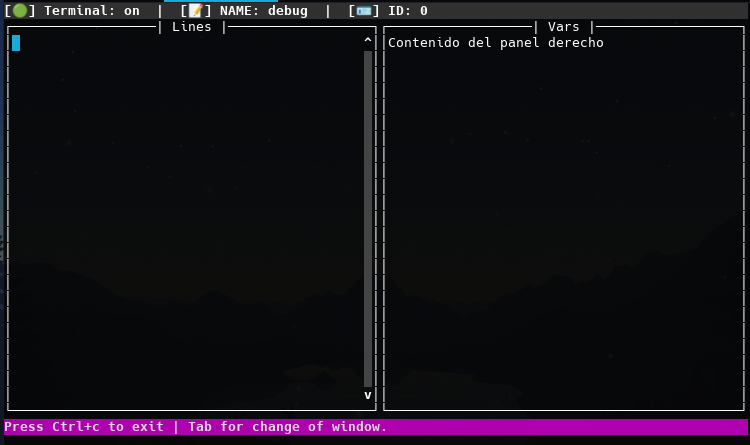

# 📙 Exterm

Gestiona fácil y rápidamente todas las salidas de terminal de tus proyectos de manera eficiente, nunca más volverás a demorar minutos o perder tus logs para siempre.



## 🎯 Objetivo

Crear una librería facil de instalar y gestionar, enfocando la facil administración de retorno de contenido a base de terminales independientes que puedes ver en diferentes ventanas.

## 👨‍💻 Ejemplo de uso

Acá puedes ver snippets conceptuales del uso de la librería:

> [!NOTE]  
> La librería está aún en construcción.

```python
from exterm import Terminal

client_id = 5122

terminal = Terminal("debug")
terminal.add_var(client_id) # El sistema hará seguimiento y mostrará todo acerca de la variable de manera intuitiva.
terminal.log(f"Procesando solicitud del cliente...")
terminal.error("Ocurrió un error al ejecutar la solicitud.")
```

💡 Esto hará que todos los logs, en lugar de mostrarse en la terminal, se almacenará en una terminal específica, el cual puedes acceder a esta de la siguiente manera:

```bash
exterm <nombre terminal>
```

Por ejemplo:

```bash
exterm debug
```

## 📧 Contacto y soporte

Puedes mandar tus dudas, contribuciones o solicitudes a través de la interfaz de esta plataforma.

> Desarrollado con ❤️ por TechAtlasDev